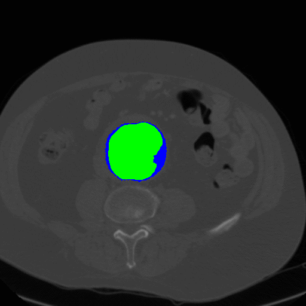
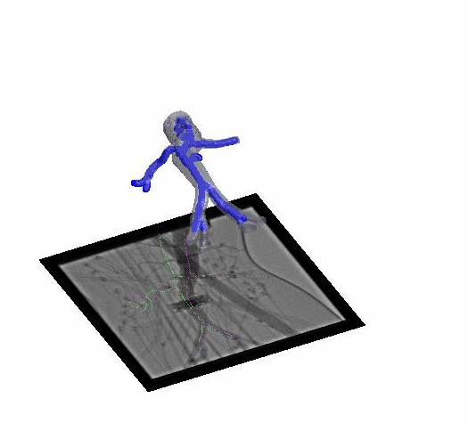

<div align="center">
<h1> Path_planning_for_FEVAR </h1>
  
[](https://ieeexplore.ieee.org/abstract/document/8793918/) \|
[](https://arxiv.org/abs/1809.05955)
</div>

Code for *ICRA'2020* paper [Towards 3d path planning from a single 2d fluoroscopic image for robot assisted fenestrated endovascular aortic repair](https://ieeexplore.ieee.org/abstract/document/8793918)

---

### Contents ###
- [0. Brief Introduction](#0-brief-intro)
- [1. Requirement](#1-requirement)
- [2. Usage](#2-usage)
  - [2.1. Script 'demo_2D3Dregist.m'](#21-script-demo_2d3dregistm)
  - [2.2. Folder 'function'](#22-folder-function)
  - [2.3. Folder 'data'](#23-folder-data)
  - [2.4. Folder 'external'](#24-folder-external)
- [3. Citing this work](#3-citing-this-work)

---
## 0. Brief Intro ##
* segmentation of abdominal aorta from a CT scan


> The segmentation process is implemented following this work: [Abdominal Aortic Aneurysm Segmentation
with a Small Number of Training Subjects](https://arxiv.org/pdf/1804.02943.pdf)

* 3D abdominal aorta shape and the center line recovered from one 2D X-ray image


* How it looks like when a catheter move through the recovered center line of aorta


---

## 1. Requirement ##
[]()
[](https://www.mathworks.com/products/matlab.html)

> Other Matlab version could be also applicable

---

## 2. Usage ##
```
$DOWNLOAD_DIR/
├── data/
|   ├── IMG26.JPG
|   ├── Label_save_P26.mat
|   ├── Skeleton3D_P26.mat
|   └── ...
├── external/
|   ├── TPS3D/
|   ├── distance2curve/
|   └── phi-max-skeleton3d-matlab-a98ad07/
├── function/
|   ├── array2str.m
|   ├── branch_classify.m
|   ├── branch_node_assign.m
|   ├── node_classification.m
|   ├── placement_match.m
|   ├── points_dist.m
|   ├── project3D22D.m
|   ├── regist2D3D.m
|   ├── regist_energy.m
|   └── trunk_node_assign.m
└── demo_2D3Dregist.m
```


### 2.1. Script 'demo_2D3Dregist.m': ###

This demonstrates how to recover a 3D skeleton for the robotic path from a 2D intra-operative segmented aneurysm shape and a 3D pre-operative skeleton. It will import a 2D jpg image of pre-operative fluoroscopy, a 2D segmentation label, and a 3D skeleton. It will display the time cost for registration of 2D/3D skeletons, the intra-operative (ground truth) skeleton, the pre-operative skeleton, and our prediction, as well as the evaluated distance errors in 2D and 3D.

### 2.2. Folder 'function': ###

It includes all the codes written for the deformable registration between 2D and 3D skeletons.
> Please kindly read the license in each file.

### 2.3. Folder 'data': ###

It includes the imported data used in the demonstration.

### 2.4. Folder 'external': ###

It includes redistributed codes used in the demonstration.
> Please kindly read the license in each file.

## 3. Citing this work
For any academic publication using the codes in this folder, please kindly cite:
- J. Q. Zheng, X. Y. Zhou, C. Riga and G. Z. Yang, "Towards 3d path planning from a single 2d fluoroscopic image for robot assisted fenestrated endovascular aortic repair", IEEE International Conference on Robotics and Automation (ICRA), 2019.
```bibtex
@inproceedings{zheng2019towards,
  title={Towards 3d path planning from a single 2d fluoroscopic image for robot assisted fenestrated endovascular aortic repair},
  author={Zheng, Jian-Qing and Zhou, Xiao-Yun and Riga, Celia and Yang, Guang-Zhong},
  booktitle={2019 International Conference on Robotics and Automation (ICRA)},
  pages={8747--8753},
  year={2019},
  organization={IEEE},
  doi={10.1109/ICRA.2019.8793918},
}
```
and, if applicable, the aorta segmentation work:
- J. Q. Zheng, X. Y. Zhou, Q. B. Li, C. Riga and G. Z. Yang, "Abdominal aortic aneurysm segmentation with a small number of training subjects." arXiv preprint arXiv:1804.02943.
```bibtex
@article{zheng2018abdominal,
  title={Abdominal aortic aneurysm segmentation with a small number of training subjects},
  author={Zheng, Jian-Qing and Zhou, Xiao-Yun and Li, Qing-Biao and Riga, Celia and Yang, Guang-Zhong},
  journal={arXiv preprint arXiv:1804.02943},
  year={2018}
}
```
